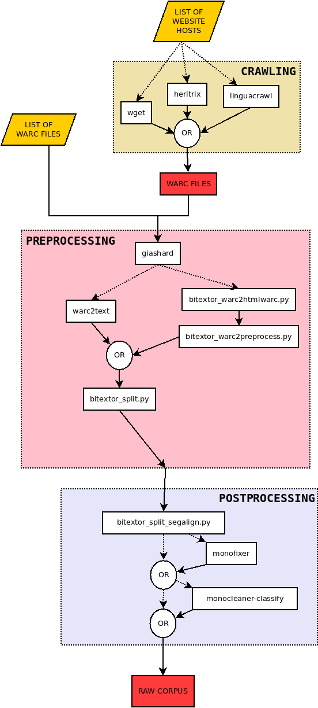

# 


[](https://discord.gg/etYDaZm)
[](https://snakemake.readthedocs.io)

`Monotextor` is a tool to automatically harvest monolingual text from websites. To run it, it is necessary to provide:

1. The source where the textual data will be searched: one or more websites (namely, Monotextor needs [website hostnames](https://en.wikipedia.org/wiki/URL) or [WARC files](https://iipc.github.io/warc-specifications/specifications/warc-format/warc-1.1/))
2. The languages on which the user is interested: language IDs must be provided following the [ISO 639-1](https://en.wikipedia.org/wiki/List_of_ISO_639-1_codes)

## Installation

Monotextor can be built from source. See [instructions here](INSTALL.md).

## Usage

```text
usage: monotextor [-C FILE [FILE ...]] [-c KEY=VALUE [KEY=VALUE ...]]
                  [-j JOBS] [-k] [--notemp] [--dry-run]
                  [--forceall] [--forcerun [TARGET [TARGET ...]]]
                  [-q] [-h]

launch Monotextor

Monotextor config::
  -C FILE [FILE ...], --configfile FILE [FILE ...]
                        Monotextor YAML configuration file
  -c KEY=VALUE [KEY=VALUE ...], --config KEY=VALUE [KEY=VALUE ...]
                        Set or overwrite values for Monotextor config

Optional arguments::
  -j JOBS, --jobs JOBS  Number of provided cores
  -k, --keep-going      Go on with independent jobs if a job fails
  --notemp              Disable deletion of intermediate files marked as temporary
  --dry-run             Do not execute anything and display what would be done
  --forceall            Force rerun every job
  --forcerun TARGET [TARGET ...]
                        List of files and rules that shall be re-created/re-executed
  -q, --quiet           Do not print job information
  -h, --help            Show this help message and exit
```

## Advanced usage

Monotextor uses [Snakemake](https://snakemake.readthedocs.io/en/stable/index.html) to define Monotextor's workflow and manage its execution. Snakemake provides a lot of flexibility in terms of configuring the execution of the pipeline. For advanced users that want to make the most out of this tool, `monotextor-full` command is provided that calls Snakemake CLI with Monotextor's workflow and exposes all of Snakemake's parameters.

### Execution on a cluster

To run Monotextor on a cluster with a software that allows to manage job queues, it is recommended to use `monotextor-full` command and use [Snakemake's cluster configuration](https://snakemake.readthedocs.io/en/stable/executing/cli.html#profiles).

## Monotextor configuration

Monotextor uses a configuration file to define the variables required by the pipeline. Depending on the options defined in this configuration file the pipeline can behave differently, running alternative tools and functionalities. For more information consult this [exhaustive overview](CONFIG.md) of all the options that can be set in the configuration file and how they affect the pipeline.

**Suggestion**: A minimalist [configuration file sample](config/basic.yaml) is provided in this repository. You can take it as an starting point by changing all the paths to match your environment.

## Monotextor output

Monotextor generates the final monolingual corpora in multiple formats. These files will be placed in `permanentDir` folder and will have the following format: `{lang}.{prefix}.gz`, where `{prefix}` corresponds to a descriptor of the corresponding format. The list of files that may be produced is the following:

* `{lang}.raw.gz` - default (always generated)
* `{lang}.sent.gz` - generated if `skipSentenceSplitting: false` or not provided.
* `{lang}.raw.paragraphs.gz` - generated if `skipSentenceSplitting: true`

See [detailed description](OUTPUT.md) of the output files.

## Pipeline description

Monotextor is a pipeline that runs a collection of scripts to produce a monolingua corpus from websites. The pipeline is divided in five stages:

1. **Crawling**: documents are downloaded from the specified websites
2. **Pre-processing**: downloaded documents are normalized, boilerplates are removed, plain text is extracted, and language is identified
3. **Sentence splitting**: split the documents into sentences
4. **Post-processing**: final steps that allow to clean the parallel corpus obtained using the tool [Monocleaner](https://github.com/bitextor/monocleaner), deduplicates translation units, and computes additional quality metrics

The following diagram shows the structure of the pipeline and the different scripts that are used in each stage:




All documents and software contained in this repository reflect only the authors' view. The Innovation and Networks Executive Agency of the European Union is not responsible for any use that may be made of the information it contains.
